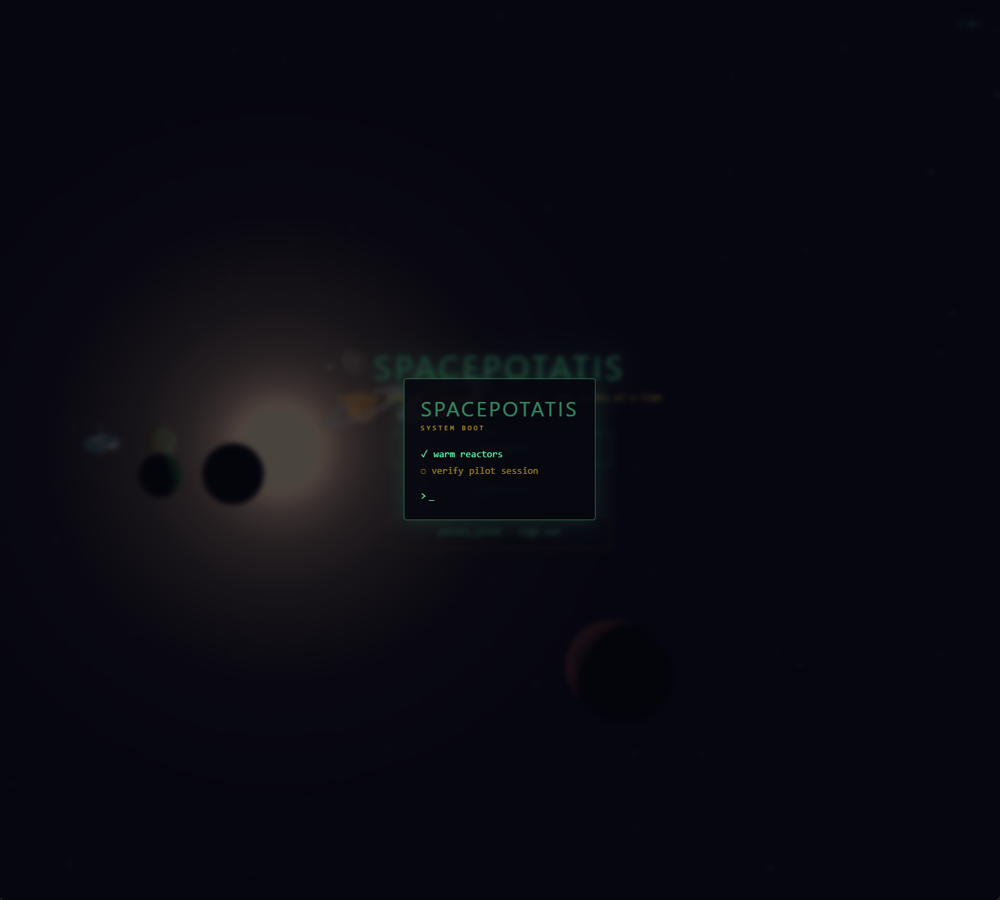
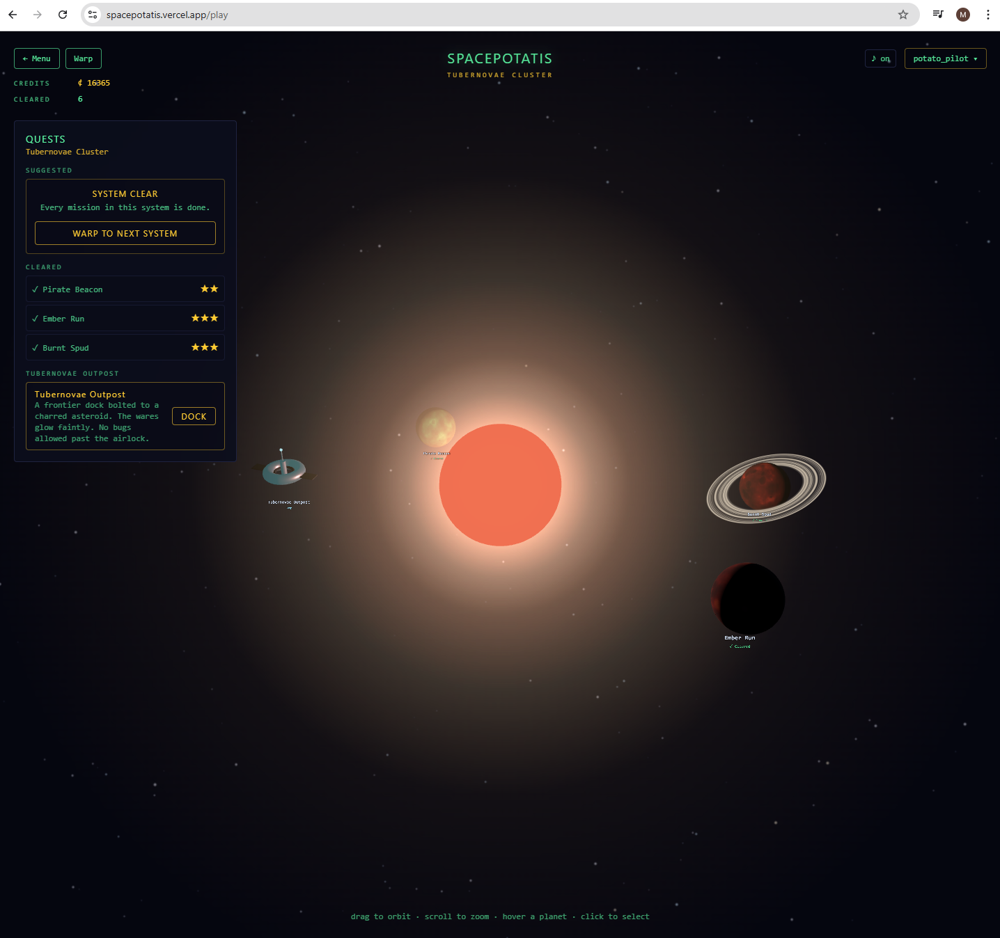
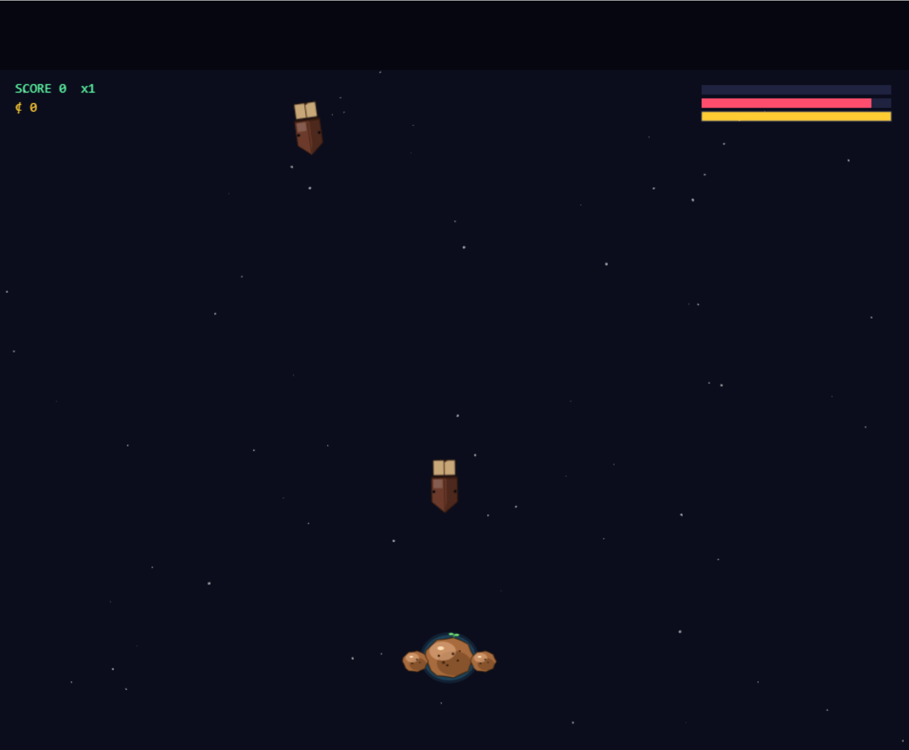

# Spacepotatis

[](https://github.com/MikkoNumminen/Spacepotatis/actions/workflows/ci.yml)

> ## ▶ Play it now: **<https://spacepotatis.vercel.app/>**
>
> Runs in your browser. No install, no sign-up. (Sign in with Google only if you want your progress saved across devices and your score on the leaderboard.)

Welcome! Spacepotatis is a small browser game where you fly a tiny spaceship around the galaxy, pick a planet, and then shoot enemies in space. Yes, you are also a potato. (Specifically: an angry one with thrust nozzles where its roots used to be.) The little badge above is the project's heartbeat — when it's green, everything builds and the tests pass; when it's red, somebody (probably the author) just broke something and is busy unbreaking it.

## What it looks like

The **front door** is a tiny system-boot sequence: a green terminal panel warms the reactors, verifies your pilot session, and only then hands you the actual menu. It's a few seconds of theatre at most, but it sets the tone — you are operating a slightly-too-old spaceship with cathode-ray sensibilities, and it would like you to wait while it remembers how to be a spaceship.



The **galaxy view** is where you decide what to do next. You're looking at an actual 3D solar system — drag with the mouse to spin the camera around, scroll the wheel to zoom, click a planet to open its mission panel. The HUD keeps the bookkeeping out of the way: top-left for the Menu and Warp buttons, just under that your credits and missions cleared, top-right for the audio toggle and your callsign. (HUD is short for "heads-up display", a term arcades and aircraft folk use for "stuff drawn on top of the world to tell you things you need to know without taking your eyes off the action".) The shot below is the **Tubernovae Cluster**, the second system you'll visit, snapped at the moment everything in it has been cleared and the game is gently prodding you toward the next system.



## Music

The calm, ambient music in the menus is original, written specifically for this game in **Strudel** — a tool where you describe music by typing short text snippets (think "play these four drum sounds in this order, twice as fast"), press a button, and hear what you wrote. It's like writing a tiny program whose output is a song; you iterate quickly and share a "song" as a few lines of text. The Strudel output is exported as a regular audio file and that's what you hear in-game. The patterns live in a sister repo: **<https://github.com/MikkoNumminen/strudel-patterns>**.

Once loaded, the music behaves the way a thoughtful background score should. The first time you click or press a key, the track quietly starts. (Browsers don't allow websites to play sound on their own — they wait for user input first, so opening a tab doesn't blast noise at you. We respect that and arm the music on your first input.) The same track keeps playing as you move between the main menu, the galaxy view, and the shop. If a song reaches its end it doesn't snap back to the start — it fades out, holds a brief silence, and fades back in, so the music draws a breath rather than reboots. Launching a combat mission ducks the music so lasers and explosions have room to land; finishing fades it back in.

The **♪ on / ♪ off** button in the top-right of every menu mutes both music and sound effects. The mute is **session-only**: every fresh page load starts with sound on, and clicking mute silences everything until you reload. We deliberately don't remember the choice between visits — that saved a whole class of "why is the page silent again" bugs caused by a stale preference quietly muting things on cold load. Click for silence, refresh for music. Your call each visit.

## Audio storyline & audio-assisted gameplay (this is a big one)

This section gets its own headline because it isn't a small touch — Spacepotatis ships a **fully-voiced narrative layer** that runs end to end, and every spoken line is original, machine-generated on Mikko's machine, and 100% copyright-free. No commercial voice actor, no licensed voice model, no tubers were harmed in the making of this audio. The voice work isn't sprinkled across a couple of cutscenes — it's the connective tissue from the front page through to the end of the campaign.

The voice does **two jobs at once**: an audiobook-style storyline that frames the game in narrative, *and* audio-assisted gameplay feedback. *"You bought a new gun." "You cleared the system — there's more out there." "Welcome back to the Market."* The line between narration and UI feedback is blurred on purpose; the player doesn't have to read a tooltip because the voice already said so.

### Meet the narrator — Grandma

Every spoken line — menu nudges, system briefing, mission setups, item-acquisition cues, story popups — is read by the same character: **Grandma**, the warm-but-no-nonsense narrator who tells you how the universe works, what the bugs are up to, and what just landed in the cargo hold. Casting one consistent voice keeps the game feeling like a single read-aloud story rather than a stack of unrelated voiceovers.

Here's a tour of every surface where Grandma's voice plays, in the order you'd encounter them.

### The main-menu briefing queue

The first thing that happens on the front page is a **voice queue** under the music: short clips with measured silence between them, nudging you toward PLAY (or CONTINUE if you already have a save). The first clip is keyed to the visible button label, so a returning player hears a different opening than a first-timer. The queue then rolls into a longer **system briefing** — essentially the audiobook prologue. Clicking PLAY cancels the queue instantly. It replays on every menu visit so an idle player always hears something happening. If the browser blocks autoplay on the first clip, your first click or keypress anywhere restarts it from the top.

### The opening cinematic — "The Great Potato Awakening"

The first time you press PLAY and reach the galaxy view, a popup fades up: a quiet music bed, the title card "The Great Potato Awakening", and a narrator reading the origin story of the potato-pilot and why the bugs need shooting. The popup also shows the words on screen for muted playback. After this first play, the entry slides into the **Story log** (below) so you can replay it.

### Per-mission briefings

Every mission planet has its own short voice briefing that fires when you click the mission card. A two-second debounce stops casual shuffling between cards from stacking briefings — click one, then another, and the first cancels. Locked planets never reveal their briefing. Each one only auto-plays the first time.

### Shop arrival

Docking at a Market planet plays a short *"You've docked at the Market"* line — on **every** visit, not just the first.

### System-cleared idle voice

Once you've cleared every combat mission in a system, a "Sol Spudensis cleared" voice plays five seconds after the last mission and loops every 20 seconds while you idle in the galaxy view. Opening the shop, the Story log, or warping cancels it. It's a gentle nudge that says *"there's more to find — go look".*

### Item-acquisition voice cues

Four short cues, one per category, fire whenever you receive a permanent item — first-clear mission rewards or shop purchases:

- A **weapon** → weapon cue
- An **augment** (a permanent modifier bound to a weapon) → augment cue
- A **ship upgrade** (shield, armor, reactor) → upgrade cue
- A **credits bonus** → money cue

The same four cues are reused everywhere a permanent item changes hands, so once the player learns *"that line means I just got a gun"*, the language stays consistent across the whole game.

### The Story log

If you missed a beat — or you just want to hear Grandma tell it again — open the **user menu** in the top-right of the galaxy view and pick **Story log**. Every storyline entry you've already unlocked sits in here, ready to replay with its music and voiceover. Entries you haven't reached stay hidden so the next chapter doesn't get spoiled. The log has its own music bed that ducks the menu music while you're browsing it, and opening a replay doesn't restart that bed — the music plays continuously across the list and any replay you open from it. Each entry also shows a **written synopsis** under its title; Grandma's spoken narration is short and read-aloud-friendly, while the synopsis is the deeper written version with room for lore that wouldn't fit comfortably in spoken text.

### How the audio is put together

The **music** for menus and story beats is written in Strudel (described in the Music section). Story beds are deliberately sparser than the menu track so narration has room to breathe.

The **voiceover** is generated by Mikko's own **AudiobookMaker** app: **<https://github.com/MikkoNumminen/AudiobookMaker>**. It feeds a written script through **Chatterbox**, an open-source text-to-speech model. The whole pipeline runs locally — no commercial voice actor, no licensed voice model, every line fully copyright-free. A practical side-effect: dialogue is cheap to iterate. Edit the script, regenerate in seconds, drop the file in. If a line doesn't land, it gets rewritten and re-spoken without booking a recording session.

## What kind of game is this?

It's a **vertical scrolling space shooter**. That's a genre where your ship sits near the bottom of the screen, the world scrolls past you from top to bottom, and waves of enemies come down toward you. You move left and right (and a bit up and down), you shoot upward, and you try very hard not to get hit. Think of the old arcade game *Galaga* — same idea, just with more potatoes and worse manners.

The specific inspiration is **Tyrian 2000**, a 1995 PC space shooter famous for its giant catalog of weapons, ship modules, and a between-mission "shop" where you'd kit out your ship before the next fight. Spacepotatis is going for the same feel, just modernized, running in your web browser, and starring a slightly more agricultural protagonist.



The HUD bars stacked in the top-right are, top to bottom: **shield** (blue, recharges over time), **hull integrity** (red, no recharge — once it's gone, you're vapour), and **reactor energy** (yellow, drains while you fire and recovers when you let go). The reactor is why you can't just hold Space forever — empty it and your guns lock out for a moment, which is a polite way of saying *"this is when you should probably dodge"*.

There are two big screens you'll see while playing:

1. **The galaxy view.** A real, rotatable 3D solar system. Each planet you can see is a thing you can do — most of them are missions (a fight), some are shops (where you spend money on upgrades), and a few are hubs. You drag the camera around with your mouse to look at planets, scroll to zoom, and click a planet to open its info panel.
2. **Combat.** Once you launch into a mission, the camera switches to the classic top-down shooter view. Your ship flies up the screen, enemies pour down, you shoot them, you dodge, you mutter at the screen. Survive long enough and you complete the mission, collect rewards, and end up back in the galaxy view to pick what's next.

The basic loop is: **galaxy → pick a planet → fight → return with money and loot → upgrade your ship at a shop → pick the next planet**. Repeat until you've thoroughly inconvenienced the bugs.

## How do I play?

The controls are deliberately tiny — there's only one fire key, so you can keep your other hand on a snack.

- **Move:** the **WASD** keys (or the arrow keys, whichever you prefer). W / Up moves the ship forward, S / Down pulls it back, A and D slide it left and right.
- **Fire:** the **Space** key. Tap it for a single volley, or hold it down for continuous fire. Every weapon you have equipped fires at the same time — each weapon slot has its own internal "cooldown" (the short pause between shots), so faster weapons fire more often than slower ones, all from the same key. You start with one weapon slot, and you can buy more slots at the shop.
- **Pause:** the **P** or **Esc** key. Once paused, P resumes; Esc abandons the mission (which counts as a loss, so be sure).
- **Galaxy view:** **drag** with the mouse to rotate the camera, **scroll** the mouse wheel to zoom in and out, and **click** a planet to open its mission panel.

That's the whole input scheme. There used to be separate keys for rear-firing and side-firing weapons, but the ship is now a single forward-firing platform with however many slots you've bought, so one Space key handles everything.

## What's under the hood?

Spacepotatis is a website that runs a game in your browser, so the technology is mostly web stuff stitched together with a generous layer of TypeScript. Here's what each piece does, in plain English:

- **Next.js 15** — the framework that serves the website itself. It handles things like "what URL shows what page" and is also responsible for serving the icons and the social-media preview image (the OG image — short for "Open Graph", the standard chat apps like Discord and WhatsApp use to fetch a thumbnail when someone pastes a link). React 19 is the UI library Next.js uses to build the menus and HUD on top of the game canvas.
- **Phaser 3** — a 2D game engine that runs in the browser. It handles the combat scenes: drawing the ship, drawing the bullets, moving everything every frame, and detecting when one thing collides with another.
- **Three.js** — a 3D library that renders the galaxy view (the planets, the sun, the starfield). GSAP, a separate animation library, smooths out the camera transitions between the galaxy view and combat.
- **Tailwind CSS** — a styling library. It's how we color buttons, lay out the HUD, that kind of thing.
- **PostgreSQL** (hosted by Neon, a serverless Postgres provider) — the database where, when you sign in, your saved games and the high-score leaderboard live. We talk to it through **Kysely**, a tiny TypeScript library that lets us write SQL safely. Database schema changes are managed by **dbmate**, which keeps a folder of plain `.sql` files describing each change. We deliberately do not use an "ORM" (Object-Relational Mapper, a tool that hides SQL behind an object-oriented API) — Kysely is closer to the metal and starts up faster.
- **NextAuth (also called Auth.js)** — handles "Sign in with Google", which is the only sign-in method. You only need it if you want your save games to follow you between devices and to appear on the leaderboard. You can play the whole game without signing in.
- **TypeScript in strict mode** — TypeScript is JavaScript with type-checking. Strict mode catches a whole class of "I forgot a value could be missing" bugs at edit time instead of runtime.
- **Vercel** — the hosting service the live website runs on. We're on the free "Hobby" tier, which is generous but limits how much server-side computation we can do, so almost everything happens in your browser instead of on a server.

## Try it on your own computer

You'll need [Node.js](https://nodejs.org/) version 20 or newer installed. (Node.js is the runtime that lets JavaScript code run outside a browser; we use it to manage the project's dependencies and to run the dev server.) Open a terminal in the project folder and follow these steps.

**Step 1 — install the dependencies.** This downloads all the libraries the project needs (React, Phaser, Three.js, etc.) into a `node_modules/` folder. You only need to do this once, and again whenever someone updates the dependencies list.

```bash
npm install
```

**Step 2 — set up environment variables (optional).** Environment variables are little settings that live outside the code, like database connection strings and secret keys. The default game runs fine without any of them — you only need this step if you want sign-in, cloud saves, or the leaderboard to work locally.

```bash
cp .env.example .env.local
# Then open .env.local in a text editor and fill in:
#   DATABASE_URL        — connection string to your Postgres database
#   AUTH_SECRET         — a random string used to sign auth cookies
#   AUTH_GOOGLE_ID      — from Google Cloud Console (OAuth credentials)
#   AUTH_GOOGLE_SECRET  — same source
```

**Step 3 — apply database migrations (only if you set DATABASE_URL above).** A "migration" is one of those `.sql` files that describes a schema change. Running migrations means applying every change in order so your database matches what the code expects. You'll need to install `dbmate` first (`brew install dbmate` on macOS, or grab a binary from the dbmate GitHub releases page on Windows/Linux).

```bash
npm run db:migrate
```

**Step 4 — start the development server.** This starts a local web server that watches the source files and rebuilds the page whenever you save a change. It also serves the game itself.

```bash
npm run dev
```

Open `http://localhost:3000` in your browser and you should see the game. If the port `3000` is busy, the dev server will pick the next free one (`3001`, `3002`, …) and tell you in the terminal.

**Without a database, what works?** Almost everything. You can play the entire game in single-player. The save / load and leaderboard features quietly fall back to in-memory storage. They only need a real database (and sign-in) if you want progress to survive a page refresh on a logged-in account.

## Quality checks before you commit

These three commands are run automatically by **CI** (Continuous Integration — a robot on GitHub that runs the same checks on every push and pull request, so broken code doesn't sneak into the main branch). You can — and should — run them locally before pushing.

```bash
# Make sure all the TypeScript types line up. Won't run the code, just checks it.
npm run typecheck

# Look for code style problems and unused variables. The "linter" is a tool that
# scans your code for likely mistakes without actually running it.
npm run lint

# Run the unit tests. Vitest is a small, fast test runner. Our tests cover
# the parts of the game that are pure logic (game data, ship state,
# weapon math, scoring) — anything you can test without drawing pixels.
npm test
```

Two more commands you might want while you work:

- `npm run test:watch` — runs the tests and re-runs them automatically every time you save a file. Useful when you're writing or fixing a test.
- `npm run coverage` — runs the tests once and produces a report showing which lines of code were exercised. Helps you see what's untested.

### A safety net at commit time (the pre-commit hook)

A "pre-commit hook" is a little script that Git runs automatically every time you make a commit, just before the commit is recorded. If the script fails, the commit is cancelled — so you can't accidentally save broken code. The first time you run `npm install` after cloning, that hook is set up for you automatically (we use a tool called **husky** to install it).

What the hook does, in order:

1. Runs the linter on **only the files you actually changed in this commit** (that's what **lint-staged** does — it filters the linter down to your staged files instead of the whole project, which keeps things fast). If the linter can auto-fix something safely (a missing semicolon, a stray import), it does, and re-stages the fixed file.
2. Runs `npm run typecheck` across the whole project to make sure your change didn't break a type somewhere else.

The whole thing usually finishes in about five seconds. If either step fails, your commit is rejected and you get to see exactly what's wrong before it ever reaches CI. Fix the problem, `git add` your changes again, and re-commit.

Tests are deliberately **not** part of the pre-commit hook — they still run on every push via CI. The goal of the hook is to catch the cheap mistakes (typos, type errors) instantly, while letting the slower, more thorough checks live on the build server.

## Recent quality push (April 2026)

Hello! If you're reading the codebase right now, you're catching it just after a big tidy-up. Over a few days the project went through a four-wave "modularity audit" — basically, a sweep that looks for files that have grown too big or rules that are easy to break by accident, and shrinks or tightens them. Here's what changed and, more importantly, why it makes the project nicer to poke at.

**Test coverage roughly doubled.** "Test coverage" is the percentage of the project's code that gets exercised by automated tests — the higher it is, the more likely a bug will be caught by `npm test` before it reaches a real player. The number of tests grew from 197 to 397, and they all pass. The combat systems (the code that decides when a bullet hits a ship, when an enemy dies, what loot drops) went from essentially zero coverage to between 80 and 100 percent. The persistence layer — the code that writes your save game to the database, fetches the leaderboard, and handles signing in — went from zero to over 95 percent. In practice that means a lot of small bugs that used to slip past will now trip a red light on CI (the GitHub robot, defined earlier, that runs the checks on every push) before they ever ship.

**A real bug got caught and fixed.** Here is the most player-visible win. Previously, if you started a combat mission while signed out, then signed in with Google partway through, then beat the mission, your final score quietly failed to save. The galaxy view would refresh and your leaderboard entry just wouldn't be there. The cause was deep in the React glue that mounts the Phaser game into the page: a piece of code captured the "you are not signed in" state at the moment the mission started, and never noticed when that changed. The fix uses something called a `useRef` (a small React tool that holds a value which can be updated freely without re-rendering the component, so the latest sign-in state is always visible to the running game). End result: sign in mid-mission and your score now lands where it should.

**Five oversized files were broken into about thirty small focused ones.** Big files are harder to read, harder to test, and they invite merge conflicts when two people edit them at once. Each of the files below was split into a small "entry point" plus a handful of single-purpose helpers. Where you see the word "barrel", that means a file whose only job is to re-export things from a few other files — useful because the rest of the project keeps importing from the same path it always did, while the actual code now lives in smaller, focused modules behind it.

The numbers below are line counts before and after the split — they show how much each main file shrank once its pieces moved out into helpers.

| File | Before | After | What came out |
| ---- | -----: | ----: | ------------- |
| `GameState.ts` | 582 | 9 | Barrel over 4 files: state core, ship mutators, persistence, sell pricing |
| `LoadoutMenu.tsx` | 590 | 98 | 9 sub-components |
| `CombatScene.ts` | 525 | 216 | 4 helpers: HUD, visual effects, drops, perks |
| `GameCanvas.tsx` | 405 | 159 | 7 hooks and sub-components |
| `Player.ts` | 257 | 123 | 3 helpers |

**JSON traffic is now type-checked at runtime by Zod.** Zod is a small library that lets you describe the shape of a piece of data once and then automatically check, at runtime, that incoming data matches that shape — and reject it with a clear error if it doesn't. Every save-game request, leaderboard request, and the responses to both, are now validated by Zod schemas at the network edge. That replaces about 80 lines of hand-written "is this field a string? is this one a number?" code that was easy to forget to update when fields changed. Now there's one schema per payload and the project relies on it.

**Phaser scenes talk to each other through a typed event union instead of raw strings.** Phaser (covered earlier in the "Under the hood" section) lets scenes broadcast events by name. Previously those names were plain strings sprinkled through the code, which means a typo or a rename could silently break communication between, say, the combat scene and the heads-up display. Now every event has a TypeScript-defined shape, and if someone renames an event the compiler points at every place that needed updating. Less magic, fewer surprises.

**The build pipeline got tougher.** Two changes here. First, CI now runs the full Next.js production build (the same kind of build that goes to the live website) on every push, not just the cheaper dev-mode checks. That catches a class of bugs that only appear when Next.js (the framework, also defined earlier) does its production-only optimizations. Second, the project's lint configuration was migrated to the new "flat config" format that ESLint (the linter — the tool that scans your code for likely mistakes — also mentioned earlier) recommends. The old format is being removed in Next.js 16, so this gets the project ahead of that deadline instead of scrambling later.

None of this changes how the game looks or feels. It just means the next person to add a new enemy, weapon, or mission has firmer ground to stand on.

## How AI helps build this game (Claude Code skills)

This project is mostly built by Mikko with help from **Claude Code**, a command-line tool that lets you have a conversation with an AI (Claude) that can read and edit files in the project. Inside the repo there's a folder called `.claude/skills/` that contains eight custom *skills* — short instruction files that teach Claude how to do specific Spacepotatis tasks correctly without re-figuring-out the project layout every single time. (There's a ninth file in there too — `new-weapon` — but it's a single-line redirect that points to `/equipment`, since equipment now covers the whole "add / change / remove a weapon" lifecycle in one place.)

Why does that matter? Every time Claude reads a file, it costs a small amount of money (paid in "tokens" — chunks of text Claude charges for). If a beginner asks "add a new enemy" and Claude has to grep around the codebase to find every file it needs to touch, that's a lot of tokens. A skill is basically a recipe: it lists the exact files to edit, the field names to use, and the invariants to keep, so Claude can go straight to the work.

Here's the catalog of skills currently shipped with the project. Type `/<skill-name>` inside Claude Code to invoke one, or just describe the task in plain English and Claude will pick the right skill itself.

| Skill                | What it does                                                                                       |
| -------------------- | -------------------------------------------------------------------------------------------------- |
| `/new-mission`       | Adds a new combat mission, picks the solar system it belongs to, and wires up waves + planet binding.|
| `/new-enemy`         | Adds a new enemy entry, generates a placeholder sprite, and (optionally) drops it into a test wave.|
| `/equipment`         | Add, change, or remove a weapon, augment, reactor, shield, or armor entry — including visual changes (bullet sprite, UI tint dot, combat HUD bars, explosion particles) and the **family** field (`potato` / `carrot` / `turnip`) that controls which weapons appear in which solar system's shop and loot pool, plus carrot weapons' optional `gravity` field for arcing ballistics. One skill covers the entire CRUD lifecycle for everything in the player's loadout, and includes a cleanup table so removing a weapon doesn't quietly break the default loadout, the in-mission upgrade ladder, or the loot pools. |
| `/new-perk`          | Adds a new mid-mission buff (a "perk") with its icon, HUD chip, and pickup logic.                  |
| `/new-solar-system`  | Adds a new solar system to the galaxy overworld — sun color/size, optional mission-gated unlock, AND the **required on-system-enter cinematic** (chapter-opener voiceover + music change on first warp into the system) so no system arrives in silence. Includes the storyTriggers test wiring so a fresh player is guaranteed to get the cinematic.  |
| `/new-story`         | Add, change, or remove in-game story content — the cinematic popups, mission/shop briefings, the spoken `body` text, the deeper written `logSummary` shown in the Story log, the music bed, and the auto-trigger wiring (which points in the game fires which beat). One skill covers the whole CRUD lifecycle, including a hard-coded-reference check so removing a story doesn't quietly break a test fixture. |
| `/balance-review`    | Diffs your uncommitted changes across every game-data surface — weapons (with family + gravity), augments, loot pools, enemies, waves, missions, perks, solar systems — and prints DPS / TTK / energy-per-DPS / augment-folded effective DPS / loot-pool roster shifts. |
| `/content-audit`     | Pre-commit invariants the unit tests don't cover: orphan refs (enemy / weapon / sprite / pod / loot-pool / mission system / story trigger), missing sprite generators, perk drop-weight sanity, mission prereq DAG, story integrity (voice + music files exist, trigger refs resolve), and storyTriggers helper coverage. Run it before opening a pull request. |

### How much does this save?

Rough estimates assuming a year of normal content authoring. "Tokens" here means the units Claude charges by — fewer tokens means cheaper and faster sessions.

| Skill                | Saved per use | Estimated uses per year | Total tokens saved |
| -------------------- | ------------: | ----------------------: | -----------------: |
| `/balance-review`    |       ~13.5K³ |                      50 |              ~675K |
| `/content-audit`     |       ~15.0K³ |                      50 |              ~750K |
| `/new-mission`       |         ~8.0K |                      30 |              ~240K |
| `/new-enemy`         |         ~5.5K |                      25 |              ~138K |
| `/new-perk`          |         ~9.0K |                      10 |               ~90K |
| `/equipment`         |  ~4.3K (avg)¹ |                      56 |              ~240K |
| `/new-solar-system`  |       ~13.0K⁴ |                       5 |               ~65K |
| `/new-story`         |  ~5.4K (avg)² |                      40 |              ~216K |
| **Total**            |               |             **266 uses** | **~2.41M tokens** |

¹ `/equipment` covers six different operations (add/change/remove × weapon/augment/equipment) with very different per-use savings — from ~0 tokens for a simple stat tweak (the skill barely beats a quick read of `weapons.json`) to ~13K tokens for removing a weapon (where the cleanup table prevents the agent from missing a hard-coded reference and shipping broken state). The 4.3K is the weighted average across an estimated mix of ~10 add-weapons, ~5 add-augments, ~30 stat tweaks, ~8 visual tweaks, and ~3 removals per year. The 240K total is more honest than the average per-use number suggests, because the high-stakes removal path also avoids a separate "fix-up commit" round-trip.

² `/new-story` covers full CRUD: CREATE (cinematic intros and voice-only briefings), MODIFY (text edits, audio re-records, trigger changes), and REMOVE (with a hard-coded-reference cleanup table). Estimated mix per year: ~4 cinematic intros (saves ~11K each), ~12 mission/shop briefings (~6K each), ~15 text rewrites (~4K each), ~6 audio re-records (~4K each), ~2 trigger reroutes (~4K each), ~1 removal (~8K — the cleanup table catches the `storyLogAudio.ts` hard-coded music path that an unaided grep misses). The 216K total absorbs the post-audit improvements from late April 2026 — a re-audit caught two real drifts (a missing trigger kind and an undocumented hard-coded reference) that an agent following the stale skill would have shipped as bugs, so the per-use figure also reflects avoided fix-up commits.

⁴ `/new-solar-system` was extended in late April 2026 to make the on-system-enter cinematic (voiceover + music change on first warp into the system) a required scaffold step, not an optional follow-up. Per-use savings up from ~10K to ~13K — the skill now covers the asset re-encoding (`ffmpeg -ac 1 -b:a 64k`), the matching `STORY_ENTRIES` entry + `StoryId` union extension, and the `selectOnSystemEnterEntry` test assertion that locks in the "fresh player always gets the cinematic" guarantee. Without the skill, an agent would have to derive all of that across `solarSystems.json`, `story.ts`, `storyTriggers.test.ts`, and the audio engine before the cinematic actually fires for new players.

³ `/balance-review` and `/content-audit` are the two utility skills that grew the most after the April 2026 quarterly audit. `/balance-review` was extended from "weapons + enemies + waves + missions + perks" coverage to also include augments, loot pools, weapon families, gravity ballistics, and solar systems — bigger surface area means each invocation now catches roughly 2K more tokens of analysis the agent would otherwise have to derive (and, on the high end, prevents a class of "JSON tweak that silently moved the credit cap" that wasn't even on the previous radar). `/content-audit` gained four new audit steps (story integrity, storyTriggers helper coverage, loot-pool integrity, mission `solarSystemId` orphan check) plus a refreshed sprite-key enumeration; per-use savings up by similar magnitude, and the skill now catches the kind of orphan reference that took a separate audit pass to find. The annual frequency stayed at 50 each because both still fire once per JSON-touching commit.

The numbers are educated guesses — actual frequency could swing 3× either way. Even on the low end, the one-time cost of writing the skills (~12K tokens) pays itself back the first week. The two heaviest hitters are `/balance-review` and `/content-audit` because they fire on every JSON change.

**The savings figures grow with the codebase, not just with usage.** Each new field, file, or invariant that lands without a corresponding skill update is a future failure mode the skill prevents — but only if the skill is kept current. The April 2026 audit found that two utility skills had drifted to ~5/10 accuracy because the codebase had grown shapes (augments, loot pools, story integrity) that the skills never knew about; once patched, the savings table jumped from ~2.15M to ~2.40M tokens/year. So the table at the bottom is real money, but only if you keep the skills in lockstep with the data shapes — figure on a quarterly re-audit pass per skill, plus an immediate update when any catalog file gains a new field.

The savings get bigger over time: every time the project's data shape evolves (a new field on weapons, a new mission attribute, etc.), the skill instructions are updated once, and every future agent gets the new pattern for free instead of having to discover it by grepping. Without skills, an agent asked to "remove this weapon from the game" today would need to read at least eight files (`weapons.json`, `types/game.ts`, `save.ts`, `ShipConfig.ts`, `persistence.ts`, `DropController.ts`, `lootPools.ts`, `ShipConfig.test.ts`) and probably still miss one of the hard-coded references — leaving the player stuck with a broken default loadout, or breaking the in-mission upgrade ladder so a critical pickup never appears. With the skill, the agent loads one recipe that names the exact files to clean and the exact line in each, and the test suite catches anything missed.

## Where to look next

If you want to understand the project deeper, here's the order to read things in:

1. **[CLAUDE.md](CLAUDE.md)** — the developer-facing rulebook for the project. Coding standards, hard rules ("no Prisma", "no `any`", "all game logic runs in the browser"), and the mapping from "what the user wants" → "which skill to invoke".
2. **[ARCHITECTURE.md](ARCHITECTURE.md)** — a tour of how data flows through the app: how a click on a planet leads to a Phaser combat scene starting, how saves are written, how the database schema is laid out.
3. **[TODO.md](TODO.md)** — the planned implementation phases and what's deliberately out of scope.
4. **[.claude/skills/](.claude/skills/)** — the eight skills mentioned above (plus the `new-weapon` redirect stub). Each one is a short markdown file you can read on its own.
5. **[src/game/data/](src/game/data/)** — the game's balance data (weapons, enemies, waves, missions, perks). All numbers live here as JSON, so you can re-tune the game without touching any code.

## License

MIT — see [LICENSE](LICENSE). MIT is a permissive open-source license: you can use, modify, and redistribute the code, including in commercial projects, as long as you include the original copyright notice.
