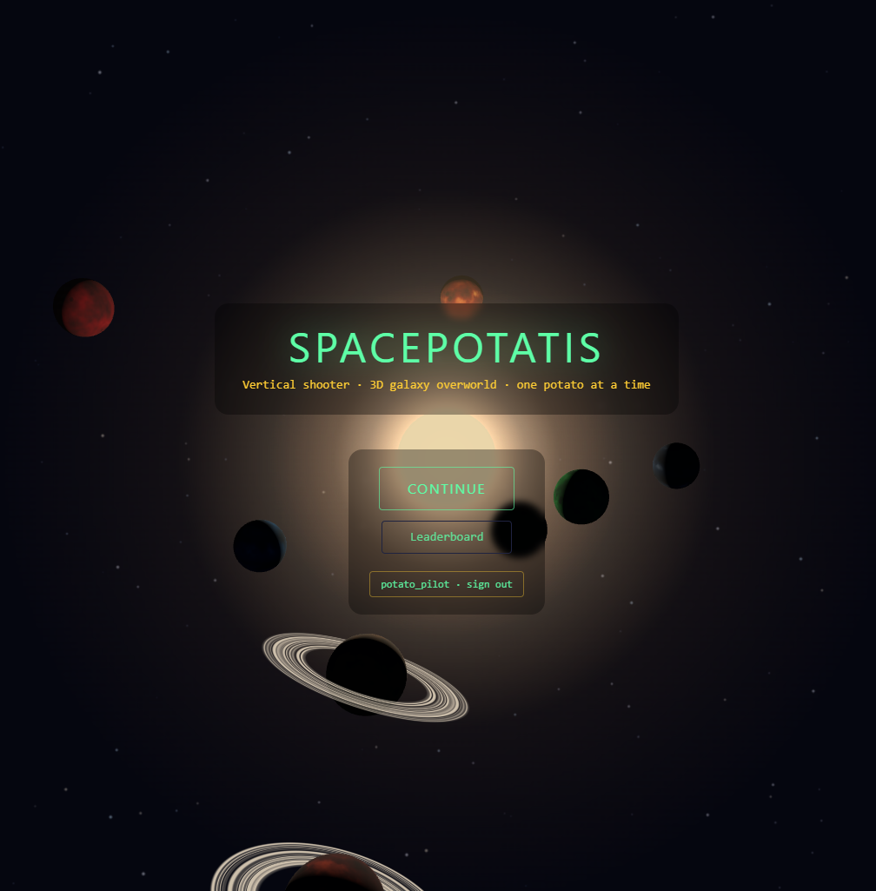
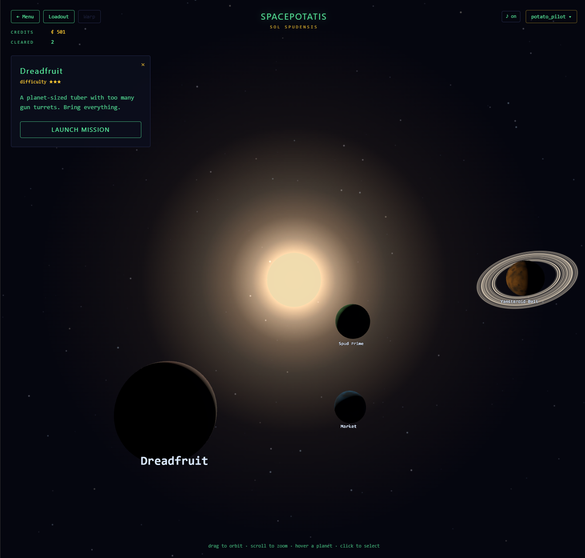
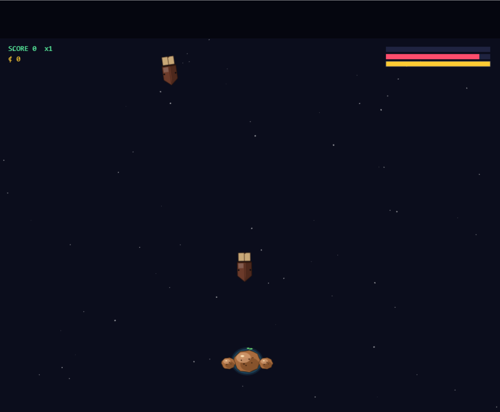

# Spacepotatis

[](https://github.com/MikkoNumminen/Spacepotatis/actions/workflows/ci.yml)

> ## ▶ Play it now: **<https://mikkonumminen.dev/spacepotatis>**
>
> Runs in your browser. No install. Sign in with Google only if you want a cloud save and a slot on the leaderboard.

Hello! This is a small browser game where you fly a tiny spaceship around the galaxy, pick a planet, and shoot bugs. You are also a potato. The little badge above is the project's heartbeat — green means everything compiles and the tests pass.

## What it looks like

The **front door** boots like a vintage terminal — green panels, a checklist, a few seconds of theatre before you reach the menu.



The **galaxy view** is a real 3D solar system. Drag to spin, scroll to zoom, click a planet to launch a mission. Below: the Tubernovae Cluster, fully cleared, prompting you to warp onward.



**Combat** is top-down vertical scrolling. Your potato sits at the bottom inside a shield bubble; bugs (and pirates) come down from above. Inspired by *Tyrian 2000* — same kit-out-your-ship-between-missions feel, modernized, browser-native, more agricultural.



## How do I play?

- **Move:** WASD or arrow keys.
- **Fire:** Space (hold for continuous; every equipped weapon fires from the same key).
- **Pause:** P or Esc (Esc abandons — counts as a loss).
- **Galaxy view:** drag to rotate, scroll to zoom, click a planet.

That's the whole input scheme. One fire key, hand free for snacks.

## Built with AI — agentic dev workflow

This codebase ships with **thirteen custom Claude Code skills** in `.claude/skills/` (plus a `new-weapon` redirect for backward compatibility). A **skill** is a short markdown file that teaches Claude how to do one specific Spacepotatis task — add an enemy, tune a weapon, ship a database migration, audit the save pipeline. It lists the exact files to edit, the field names to use, and the invariants to keep. Without a skill, every "add a new enemy" run starts with grepping the codebase to re-derive the same five files. With a skill, Claude goes straight to the work.

Each skill is invoked with `/<name>` (or Claude auto-picks based on the task description) and is a self-contained markdown file you can read alone in [`.claude/skills/<name>/SKILL.md`](.claude/skills/).

### The catalog

| Skill | What it does | Saved per use | Uses/yr | Total/yr |
|---|---|---:|---:|---:|
| [`/content-audit`](.claude/skills/content-audit/SKILL.md) | Pre-commit invariants — orphan refs, missing sprite generators, mission DAG, story integrity, loot-pool sanity | ~15.0K | 50 | ~750K |
| [`/balance-review`](.claude/skills/balance-review/SKILL.md) | Diff content JSON and report DPS, TTK, energy-per-DPS, loot-pool deltas vs HEAD | ~13.5K | 50 | ~675K |
| [`/ai-codegen-smell-audit`](.claude/skills/ai-codegen-smell-audit/SKILL.md) | PR-time check for 10 AI-codegen failure modes (defensive null checks on non-nullable types, paraphrase comments, phantom TODOs, swallowed errors, duplicated helpers…) | ~10.0K | 30 | ~300K |
| [`/equipment`](.claude/skills/equipment/SKILL.md) | Add / modify / remove weapons, augments, reactor, shield, or armor — full CRUD across stats, sprites, prices, and the loadout UI | ~4.3K avg | 56 | ~240K |
| [`/save-roundtrip-audit`](.claude/skills/save-roundtrip-audit/SKILL.md) | Walk every `StateSnapshot` field through the 8 save-pipeline layers; flag any layer that silently drops the field | ~12.0K | 20 | ~240K |
| [`/new-mission`](.claude/skills/new-mission/SKILL.md) | Scaffold a combat mission — `missions.json`, `waves.json`, galaxy planet binding, smoke test | ~8.0K | 30 | ~240K |
| [`/new-story`](.claude/skills/new-story/SKILL.md) | CRUD on story content — cinematic popups, voiceovers, music beds, body + log text, auto-trigger wiring | ~5.4K avg | 40 | ~216K |
| [`/new-enemy`](.claude/skills/new-enemy/SKILL.md) | Scaffold a new enemy — `enemies.json`, `BootScene` sprite generator, optional wave, integrity check | ~5.5K | 25 | ~138K |
| [`/new-migration`](.claude/skills/new-migration/SKILL.md) | Postgres schema migration end-to-end — dated SQL, `Database` interface, prod-apply, schema check, PR-checkbox gate that prevents a 500-on-save regression | ~7.0K | 15 | ~105K |
| [`/new-perk`](.claude/skills/new-perk/SKILL.md) | Scaffold a mission-only perk — `perks.ts` entry, BootScene icon, HUD chip, optional active-handler in `PerkController` | ~9.0K | 10 | ~90K |
| [`/new-solar-system`](.claude/skills/new-solar-system/SKILL.md) | Add a galaxy solar system — `solarSystems.json` entry, required on-system-enter cinematic (voice + music) and dedicated galaxy music bed | ~13.0K | 5 | ~65K |
| [`/security-audit`](.claude/skills/security-audit/SKILL.md) | Orchestrate the 5-phase security audit + remediation (attack-surface map → prioritized plan → fixes with regression tests → AI-first security docs → verification) | ~5.0K | 10 | ~50K |
| [`/modular-architecture-audit`](.claude/skills/modular-architecture-audit/SKILL.md) | Orchestrate the 5-phase modular-architecture audit + refactor (inventory → boundaries → mechanical extraction → docs → verification) | ~5.0K | 5 | ~25K |
| **Total (13 functional skills)** | | | **346** | **~3.13M** |

Plus a 14th file: [`/new-weapon`](.claude/skills/new-weapon/SKILL.md) — a 230-token stub that redirects to `/equipment` so fresh users typing the old name get a useful redirect instead of "skill not found." Net token save ≈ 0; kept as a convention.

**How to read the numbers.** *Saved per use* is the cost of an agent doing the same task without the skill (grep + read + retry on missed conventions) minus the cost of invoking the skill. *Uses/yr* is an educated estimate from the project's content cadence and PR pace, not telemetry. The total figure is **comparing skill-guided runs against from-scratch grep-and-derive passes on the same task** — full methodology and per-skill rationale in [docs/SKILLS.md](docs/SKILLS.md). The most recent full-catalog audit is at [docs/audits/skills-2026-05-19.md](docs/audits/skills-2026-05-19.md).

The interesting AI wrinkle isn't "Claude wrote some code." It's the **operating model**: skills are version-controlled, audited regularly, and treated as production artifacts. Drift between a skill and the code it references is a real category of bug — the April 2026 per-skill audit caught two utility skills that had drifted to ~5/10 accuracy because the codebase had grown shapes the skills never knew about. Once patched, the savings table jumped ~250K tokens/year. The repo is a small case study in keeping AI-assisted development reproducible.

## All the audio is mine — and so are the tools that made it

Every note of music and every spoken line in the game is original, generated locally, and 100% copyright-free. No commercial voice actor, no licensed voice model, no stock library. Both pipelines live in their own repos:

- **Music** → written in [Strudel](https://strudel.cc), a live-coding tool where you describe music with short text snippets. Patterns: <https://github.com/MikkoNumminen/strudel-patterns>. Strudel exports clean audio files that drop straight into the game.
- **Voice** → narrated by *Grandma*, one consistent character across menus, briefings, item-pickup cues, and a replayable Story log. Generated by [**AudiobookMaker**](https://github.com/MikkoNumminen/AudiobookMaker), a small wrapper around the open-source Chatterbox text-to-speech model. Edit the script, regenerate in seconds, drop the file in.

The voice does double duty: audiobook-style narrative *and* gameplay feedback. *"You bought a new gun." "You cleared the system — there's more out there."* The line between story and tooltip is blurred on purpose — the player doesn't have to read a tooltip because the voice already said so. Music and voice both implement all the boring autoplay-and-mute correctness underneath.

## What's under the hood?

A web stack stitched with TypeScript:

- **Next.js 16 + React 19** — pages, layout, the shell around the game canvas.
- **Phaser 4** — 2D combat scenes (ship, bullets, collisions).
- **Three.js + GSAP** — the 3D galaxy view and the camera transition into combat.
- **Tailwind CSS** — styling.
- **PostgreSQL on Neon, talked to via Kysely** — saves and leaderboard. No ORM; we write SQL through a typed builder. Schema migrations are plain `.sql` files in `db/migrations/`.
- **NextAuth (Google OAuth only)** — sign-in is optional; the game runs fully offline-capable without it.
- **TypeScript strict** — no `any`, no implicit nulls, no shortcuts.
- **Vercel Hobby tier** — a cost ceiling that drove the whole architecture: client-side first, static-by-default, Edge runtime where possible. The same artifact would scale to Pro without code changes; the ceiling shaped the design.

## Try it on your own computer

You'll need [Node.js](https://nodejs.org/) ≥ 20.

```bash
npm install      # one-time, downloads dependencies
npm run dev      # starts http://localhost:3000
```

That's enough to play the entire single-player game. Database is optional — without it, save/load and leaderboard fall back to in-memory and degrade silently. To enable cloud saves locally:

```bash
cp .env.example .env.local    # fill in DATABASE_URL + AUTH_GOOGLE_* + AUTH_SECRET
npm run db:migrate            # apply schema
```

## Quality gates

CI runs all of these on every push. You can run them locally too:

```bash
npm run typecheck    # tsc --noEmit
npm run lint         # eslint flat config
npm test             # vitest, ~1400 tests
npm run build        # full production build
```

A pre-commit hook (auto-installed via husky on `npm install`) runs lint-staged + typecheck in ~5 seconds. Tests stay on push so they don't slow your commit cycle.

## A real player lost their save (May 2026)

Spoiler: the player was the developer's own account. The game's save endpoint had three anti-cheat guards that all checked things hadn't grown too FAST. None checked if something had grown SMALLER. So when a buggy client posted credits=0, completedMissions=[], the server happily wrote zeros over a real save.

Acute fix shipped within hours: server-side `validateNoRegression` + a client-side hydration gate. Then a forensic `save_audit` table so the next post-mortem starts with SQL instead of guesswork. Then a daily GitHub Actions cron that opens an issue when there's enough data to inform the deeper structural fix (append-only `save_snapshots`, currently in the backlog).

The point isn't that production broke. The point is the response: **mitigation first, post-mortem later, observability before architecture**. Full play-by-play in [docs/INCIDENT_RUNBOOK.md](docs/INCIDENT_RUNBOOK.md).

## Where to look next

1. **[CLAUDE.md](CLAUDE.md)** — the developer-facing rulebook (coding standards, hard rules, skill routing).
2. **[ARCHITECTURE.md](ARCHITECTURE.md)** — data-flow tour: planet click → Phaser combat → save round-trip.
3. **[TODO.md](TODO.md)** — backlog and out-of-scope decisions.
4. **[.claude/skills/](.claude/skills/)** — the agentic recipes mentioned above. Read any one in isolation.
5. **[src/game/data/](src/game/data/)** — game balance as JSON. Re-tune the game without touching code.

## License

MIT — see [LICENSE](LICENSE). Use, modify, redistribute, including commercially; just keep the copyright notice.
